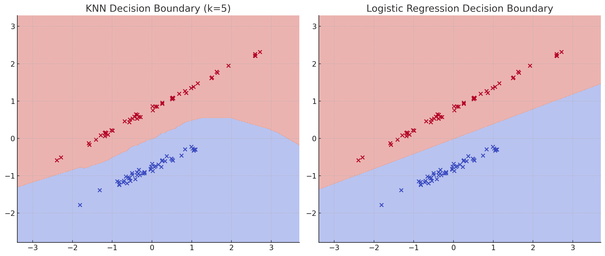

# 🤝 K-Nearest Neighbors (KNN) vs Logistic Regression — Conceptual & Visual Comparison

---

## 📘 What is K-Nearest Neighbors?

**K-Nearest Neighbors (KNN)** is a **supervised learning** algorithm used for both classification and regression.

It is a **non-parametric**, **instance-based** model, which means:
- It doesn’t learn a model during training
- It stores the training data and makes predictions based on proximity

---

## 🔍 How KNN Works

1. Choose `K` (number of neighbors)
2. Measure distance from the new point to all training points (usually **Euclidean distance**)
3. Pick the `K` closest neighbors
4. Use **majority vote** to classify (or average for regression)

---

## 📐 Distance Function

**Euclidean Distance** between A = (x₁, y₁) and B = (x₂, y₂):

Distance = sqrt((x₂ - x₁)² + (y₂ - y₁)²)

---

## 🎯 KNN Use Case: Fruit Classification

| Weight | Sweetness | Fruit |
|--------|-----------|-------|
| 150g   | 7         | Apple |
| 170g   | 6         | Apple |
| 140g   | 10        | Mango |
| 130g   | 9         | Mango |

New fruit → 145g, 8 sweet → Nearest neighbors = [Apple, Mango, Mango] → 🍋 Predicted = **Mango**

---

## 📊 Visualization: KNN vs Logistic Regression

### Left: KNN (k=5)
- Non-linear boundary
- Follows the training data’s shape

### Right: Logistic Regression
- Linear boundary
- Best for linearly separable data

---

## 🧪 Model Evaluation (on test set of 30 samples)

Both models were trained on a 2D synthetic dataset and achieved:

| Metric        | KNN (k=5) | Logistic Regression |
|---------------|-----------|---------------------|
| Accuracy      | 100%      | 100%                |
| Precision     | 1.00      | 1.00                |
| Recall        | 1.00      | 1.00                |
| F1 Score      | 1.00      | 1.00                |

> ☑️ Both models performed perfectly — but on simple, clearly separated data.

---

## 📈 Decision Boundary Summary

| Aspect                   | KNN                                 | Logistic Regression            |
|--------------------------|--------------------------------------|--------------------------------|
| Type                     | Non-parametric, lazy learner         | Parametric, probabilistic      |
| Decision Boundary        | Flexible, non-linear                 | Straight-line (linear)         |
| Training Time            | Instant (no training)                | Fast                           |
| Prediction Time          | Slower (distance calc on all points) | Very fast                      |
| Works Well When          | Data is non-linear, small datasets   | Data is linearly separable     |
| Needs Feature Scaling    | ✅ Yes                                | ✅ Yes                          |

---

## ✅ Strengths & Weaknesses

| Algorithm         | Strengths                            | Weaknesses                         |
|-------------------|---------------------------------------|-------------------------------------|
| **KNN**           | Intuitive, no training needed         | Slow on large data, needs scaling  |
| **Logistic Reg.** | Fast, interpretable, probabilistic    | Struggles with non-linear patterns |

---

## 🧰 Common Use Cases

| Domain         | KNN                          | Logistic Regression                |
|----------------|-------------------------------|------------------------------------|
| Healthcare     | Disease classification        | Disease risk prediction (prob.)    |
| Finance        | Credit risk categorization    | Default prediction (yes/no)        |
| Image/Data     | Digit/image classification    | Spam email detection               |
| Education      | Pass/Fail prediction (local)  | Admission prediction (linear)      |

---

## 🧭 Final Note

- Use **Logistic Regression** for **simple, fast, linearly separable problems**.
- Use **KNN** when your data is **non-linear, clustered, or unstructured**.

🎯 _Choose your classifier wisely based on data shape, size, and interpretability needs._

