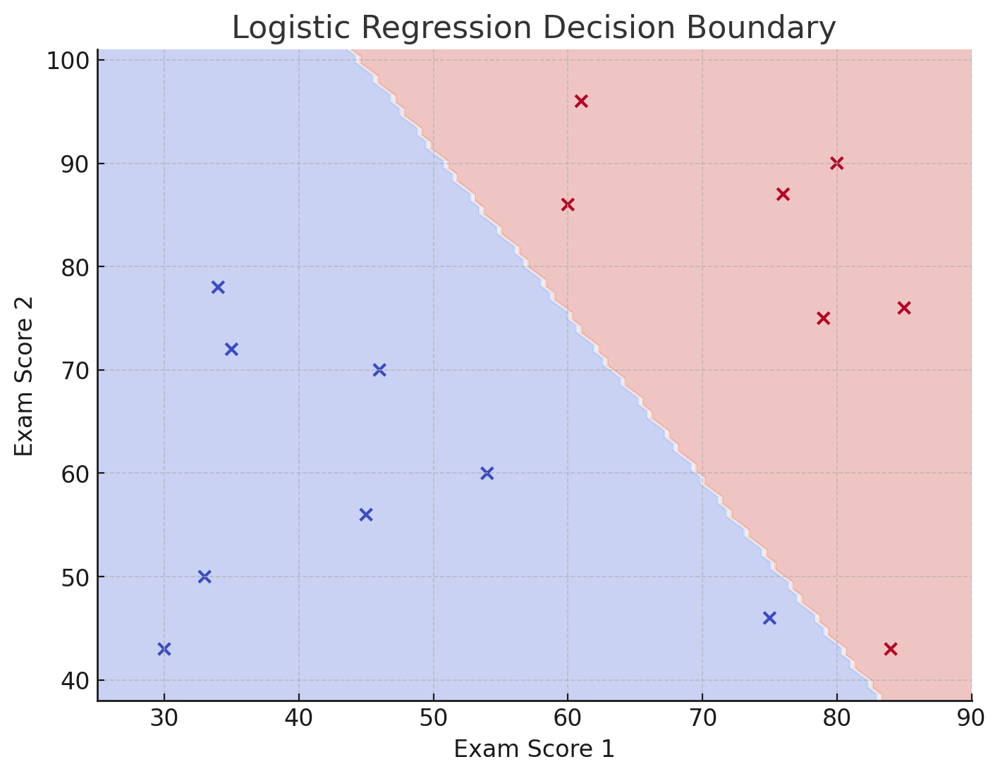

# 🧠 Logistic Regression — Complete Conceptual Guide

---

## 🔍 What is Logistic Regression?

**Logistic Regression** is a **supervised learning algorithm** used for **classification problems** — most commonly **binary classification**.

Despite its name, logistic regression is **not used for regression** problems. It is designed to estimate **probabilities** that map input features to discrete class labels (e.g., Yes/No, 0/1, Spam/Not Spam).

---

## 📐 The Logistic (Sigmoid) Function

Logistic regression outputs probabilities using the **sigmoid function**:

P(y=1) = 1 / (1 + e^-(β₀ + β₁x₁ + β₂x₂ + ... + βₙxₙ))

- The output of the sigmoid function is always between **0 and 1**.
- If the output probability > 0.5, the model predicts class `1`; otherwise, it predicts class `0`.

---

## 🧠 How It Works

1. Logistic regression learns **weights** (`β₁, β₂, ..., βₙ`) for the features.
2. These weights are applied to input features and passed through the **sigmoid function** to get a probability.
3. A **threshold** (default = 0.5) is applied to convert probability to class label.

---

## 🎯 Example Use Case: Student Admission Prediction

### Problem:
Predict whether a student will be admitted based on scores in **Exam 1** and **Exam 2**.

| Exam Score 1 | Exam Score 2 | Admitted |
|--------------|--------------|----------|
| 34           | 78           | No (0)   |
| 80           | 90           | Yes (1)  |
| 45           | 56           | No (0)   |
| 84           | 43           | Yes (1)  |

The logistic regression model learns a **decision boundary** between admitted and not admitted students based on their exam scores.

---

## 🧪 Why Use Logistic Regression?

- When your target variable is **binary or categorical**
- When you want a **probabilistic interpretation** of output
- When interpretability matters (coefficients show feature impact)
- Simple, fast, and efficient for **linearly separable data**

---

## 📈 Visualization: Decision Boundary

In 2D problems (like this one), logistic regression produces a **linear decision boundary**:

### 🔵 Below the Line = Class 0 (Not Admitted)  
### 🔴 Above the Line = Class 1 (Admitted)

The plot shows:

- Points: each student (plotted by Exam Score 1 vs Exam Score 2)
- Colored regions: predicted class area
- Decision boundary: the threshold line where probability = 0.5

### 📊 What the Plot Tells You:
- If a student is **above the line**, they’re likely to be admitted.
- If **below the line**, they’re likely to be rejected.
- The further a point is from the line, the more confident the model is.

### 🖼️ Example Visualization:

---

## 🧰 Real-World Applications of Logistic Regression

| Domain         | Use Case                                             |
|----------------|------------------------------------------------------|
| Healthcare     | Disease prediction (e.g., cancer: yes/no)            |
| Finance        | Loan default prediction                              |
| Marketing      | Customer churn prediction                            |
| Email Systems  | Spam vs. non-spam classification                     |
| HR Analytics   | Employee attrition (Will leave or not?)              |
| Education      | Student performance (Pass/Fail, Admitted/Not)        |

---

## ✅ Summary

| Item                    | Description                                 |
|-------------------------|---------------------------------------------|
| Algorithm Type          | Classification (Binary / Multiclass)        |
| Output                  | Probability (0 to 1) → Class (0 or 1)        |
| Function Used           | Sigmoid (logistic)                          |
| Visualization           | Linear decision boundary in 2D              |
| Strengths               | Simple, fast, interpretable                 |
| Weaknesses              | Struggles with non-linear data              |

---

## 🧭 Next Steps in Learning

After mastering logistic regression, you should explore:

- 🔢 **K-Nearest Neighbors (KNN)**
- 📐 **Support Vector Machines (SVM)**
- 📊 **Decision Trees and Random Forest**
- 🧠 **Naive Bayes and Neural Networks**

These will help you handle **non-linear data**, **multiclass classification**, and more complex problems.

